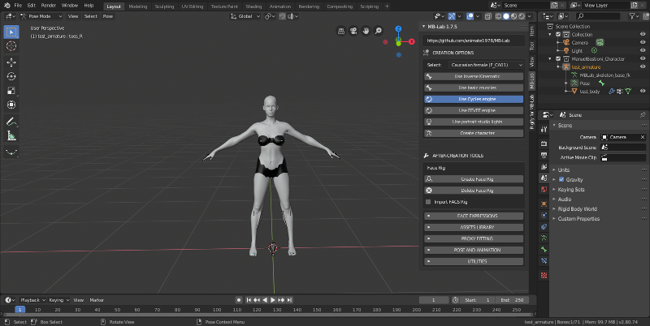

After Creation Tools / Инструменты после создания
===================

После завершения моделирования вашего персонажа MB-Lab вернется к панели интерфейса по умолчанию.

Область инструментов «После создания» содержит функции, которые могут помочь с пост-созданием персонажей, такие как позы, анимация и добавление одежды.

* Выражения лица
* Добавить одежду или полигональные волосы
* Подгоните активы под своего персонажа
* Позы
* Анимация
* Вспомогательные инструменты

Следует отметить, что эти функции также возможны с использованием инструментов Blender по умолчанию, эти функции являются помощниками или автоматизированными частями, которые не являются совершенными и в некоторых случаях содержат ошибочный код.

Некоторые из этих функций также являются экспериментальными и могут развиваться или отбрасываться в пользу лучших методов, инструментов или кода.

.. toctree::
   :maxdepth: 2

   face_rig
