===============
База персонажей
===============

Базовые персонажи являются результатом многолетнего опыта моделирования людей. Каждый из них построен на профессиональной сетке, которая учитывает основные требования, которые должна иметь каждая хорошая модель:

* Модель оптимизирована для поверхности подразделения, избегая лишних многоугольников и треугольников.
* Топология имеет петли для идеальной деформации во время поз и анимации, в том числе петли для лица, необходимые для морщин основного выражения.
* Топология позволяет моделировать наиболее актуальные черты лица и тела.
* Полюса структурированы так, чтобы быть минимальными и использоваться только там, где это необходимо.
* Топология удобочитаема, чтобы художники могли легко ее настроить.
* Топология разработана для оптимальной работы с Blender, Mudbox, Zbrush и т. Д.

Все персонажи включают в себя полные модели зубов и глаз, и все они обеспечивают реальную геометрию ресниц, чтобы их можно было экспортировать повсюду, независимо от системы частиц Блендера.

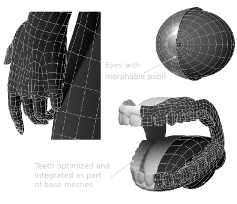

Базовые символы смоделированы после точных исследований анатомии и антропологии. Пропорции и особенности лица создаются с использованием статистических данных, чтобы извлечь средний идеальный символ для каждого фенотипа.

Для того, чтобы не подвергаться цензуре, модели не включают гениталии.

Все основные персонажи, доступные в MB-Lab, смоделированы Мануэлем Бастиони. Доступны следующие модели:

================
Caucasian female / Кавказская женщина
================

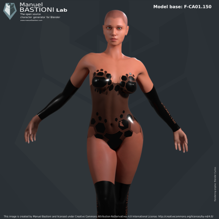

============
Asian female / Азиатская женщина
============

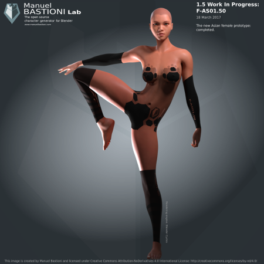

===========
Afro female / Африканская женщина
===========

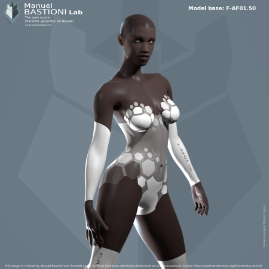

==============
Caucasian male / Кавказский мужчина
==============

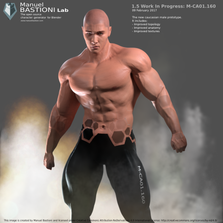

==========
Asian male / Азиатский мужчина
==========

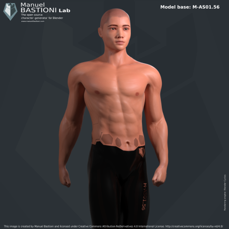

=========
Afro male / Африканский мужчина
=========

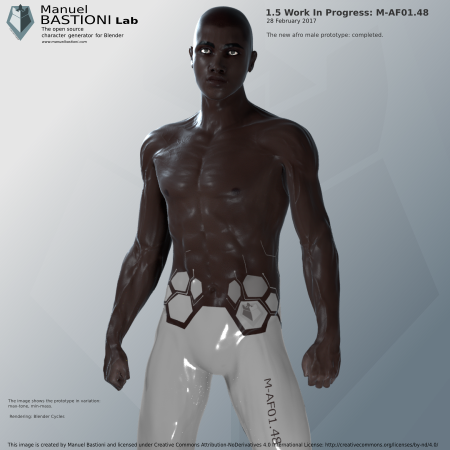

==========================
Anime female style shojo01 / Аниме женщина стиль сёдзё 01
==========================

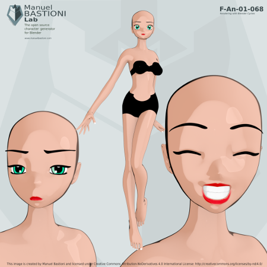

==========================
Anime female style shojo02 / Аниме женщина стиль сёдзё 02
==========================

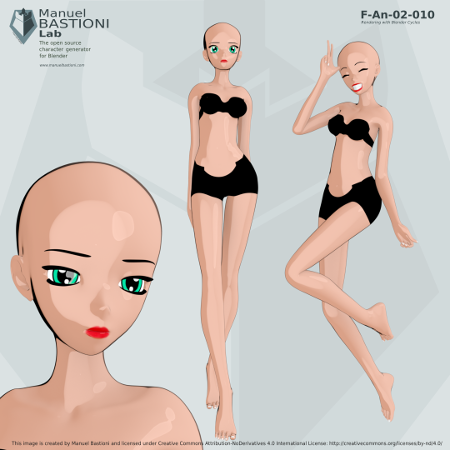

============================
Anime female style realistic / Аниме женщина реалистичный стиль
============================

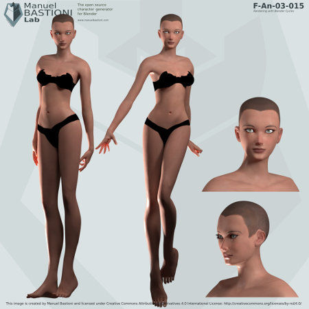

========================
Anime male style shojo01 / Аниме мужчина стиль сёдзё 01
========================

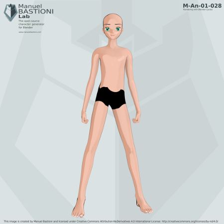

========================
Anime male style shojo02 / Аниме мужчина стиль сёдзё 02
========================

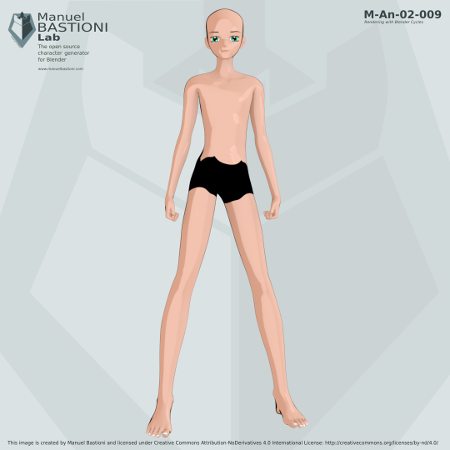

==========================
Anime male style realistic / Аниме мужчина реалистичный стиль
==========================

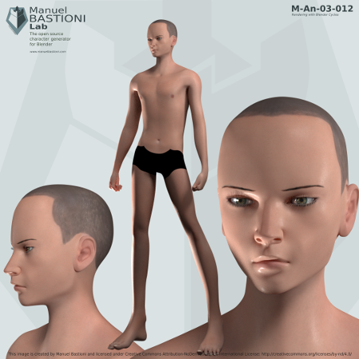

==========
Elf female / Эльф женщина
==========

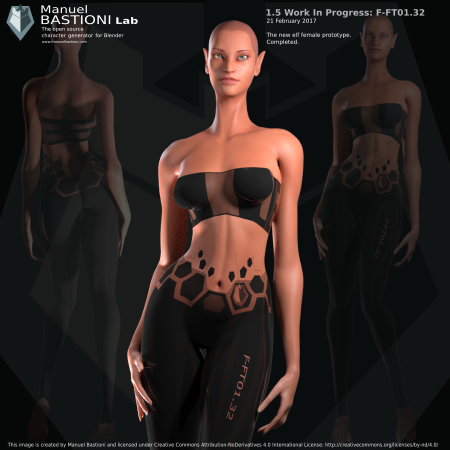

========
Elf male / Эльф мужчина
========

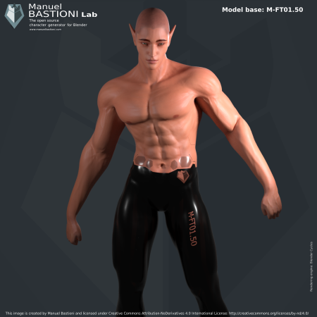

==========
Dwarf male / Мужчина -карлик
==========

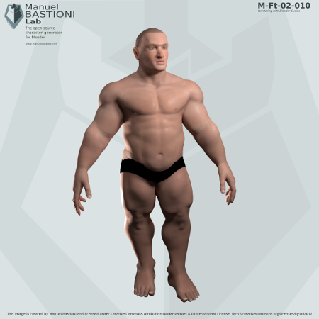

