==============
Creation Tools / Инструменты создания
==============

После создания персонажа человеческая модель с базовыми пропорциями помещается в центр сцены Blender, а на панели MB-Lab появится ряд инструментов для ее изменения.

Существует шесть способов манипулирования персонажем:

* Использование мета параметров: масса тела, тонус тела и возраст
* Загрузка пресета из библиотеки символов: типы, специальные типы и фенотипы.
* Использование квазислучайного генератора.
* Использование автомодельного инструмента.
* Изменение параметров «низкого уровня»: нос, глаза, рот, ноги и т. Д.
* Использование инструмента измерения.

===============
Meta parameters / Метапараметры
===============

Метапараметры являются наиболее интуитивно понятным способом определения символа. Используя эту технологию, определение основных черт характера персонажа занимает считанные секунды. Пользовательский интерфейс очень прост для понимания: всего три интуитивно понятных слайдера для значений возраста, массы и тона.

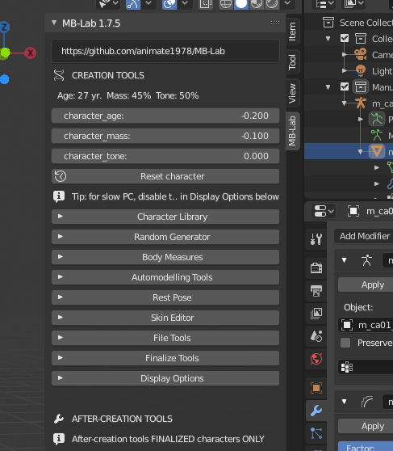

* Возраст может варьироваться от 18 до 80 лет.
* Масса может варьироваться от 0% до 100%.
* Тонус может варьироваться от 0% до 100%

Процент, используемый для тона и массы, указывает на изменение этих параметров от минимального значения (0%) до максимального значения (100%). Таким образом, 0% массы предназначено не как персонаж без массы, а как персонаж с минимальным количеством массы, необходимым для "жизни".

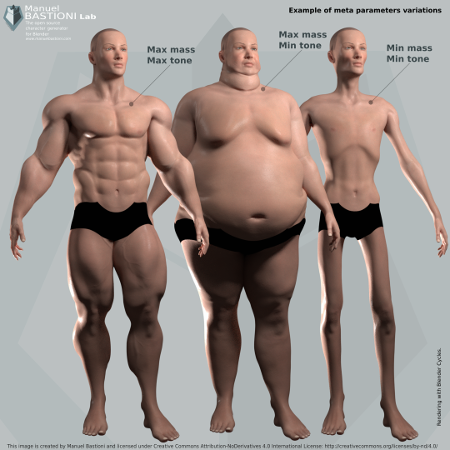

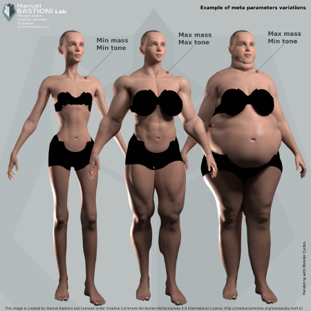

Высота не является одним из мета-параметров, потому что она обрабатывается отдельно в системе размеров

За этими тремя операторами стоит сложный алгоритм, который оценивает в реальном времени десятки характеристик тела, используя нелинейные вычисления для моделирования формы человеческого тела в различных условиях. В качестве примера на изображении ниже показан обзор нелинейной функции, используемой для расчета эффекта возраста от 18 до 80 лет.

Эффект мета-параметров очень легко предсказать: увеличение массы приведет к увеличению объема тела, но «качество» этой массы зависит от тонуса. Конечно, как «тонус», так и «масса» уровней зависят от возраста.

==============
Preset library / Предустановленная библиотека
==============

Другой способ быстрого определения персонажа - загрузка параметров непосредственно из библиотеки предустановок.

«Тип» определяет в одном кадре все основные черты тела: строение кости, процент жира, массу и мышцы. Каждый тип создается на основе антропометрических данных и художественных наблюдений и очерчивает тело персонажа. Типы маркируются с использованием простых имен, таких как «идеальная мода», «атлетический», «ленивый», «песочные часы».

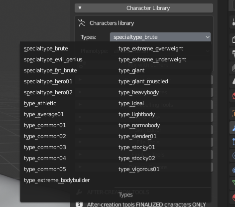

Система использует идентификаторы такого рода, потому что они менее трудны для запоминания и более интуитивны, чем научные термины, используемые в антропометрии.

Типы могут быть выбраны через интуитивно понятный графический интерфейс на главной панели, также можно использовать опцию «Смешать» для смешивания различных типов.

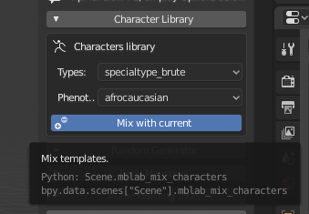

«Специальный тип» отличается от «типа», потому что он может описывать нереалистичные существа (например, комических героев, грубых и других людей с увеличенными пропорциями) или объекты только для данных (например, «старые» и «младшие» специальные типы). ).

В зависимости от изменяемых функций и способа их изменения, типы могут быть сгруппированы в категории

* Типы определяются в основном вариациями мышечного и массового процента
* Сложные типы, определяемые изменением пропорций, массы и мышц
* Типы, определенные основными формами

Также библиотека включает в себя важную базу данных по этническим фенотипам:

* Афрофенотипы
* Азиатские фенотипы
* Кавказские фенотипы

Есть также типы и фенотипы для персонажей аниме

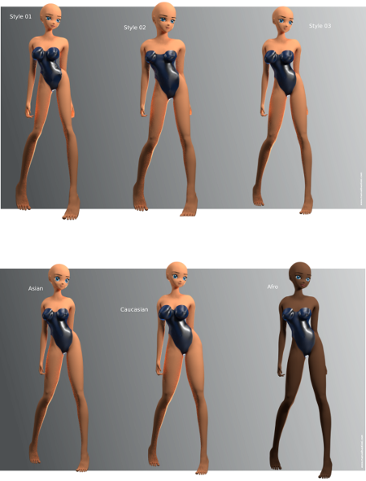

================
Random Generator / Генератор случайных чисел
================

Другой способ создания символов - использование генератора квазислучайных данных, который не является полностью случайным, но частично контролируется некоторыми параметрами.

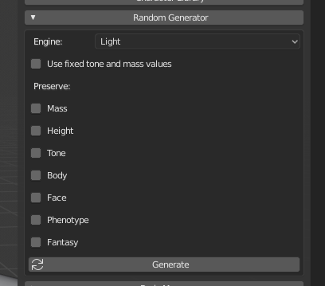

Движок включает в себя несколько новых алгоритмов, где наиболее интересным является, вероятно, вариант «фенотип», который автоматически создает варианты характера, сохраняя преобладающие характеристики «днк».

Другим фундаментальным параметром является масштаб рандомизации.

Он проходит от уровня «Light» до уровня «Extreme» через пять степеней интенсивности.

Используя первые два уровня, сгенерированные персонажи будут реалистичными и правдоподобными в диапазоне человеческих вариаций. При использовании других параметров результаты будут нереальными и гротескными.

Пять персонажей, созданных с помощью реалистичного движка

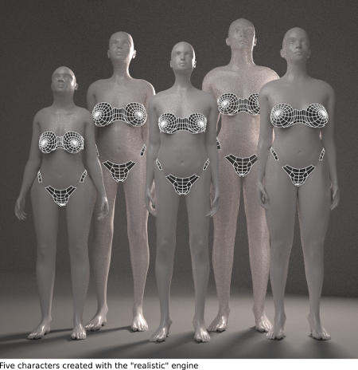

Пять персонажей, созданных с использованием экстремального движка

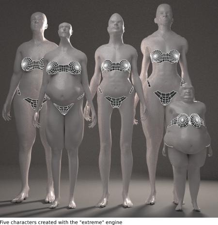

Главная особенность, которая делает квазислучайный генератор очень мощным инструментом моделирования, заключается в том, что его можно использовать в сочетании с другими инструментами MB-Lab.

Другие ограничения более интуитивны: во время генерации можно сохранить массу, мышцы, рост и лицо персонажей.

Это очень полезно, например, если вам нравится лицо случайно сгенерированного символа, но не тело, вы можете ограничить лицо и генерировать новые варианты.

=============
Auto-Modeling / Авто-моделирование
=============

Система автоматического моделирования - это инновационный способ определения персонажа, начиная с 3D-черновика.

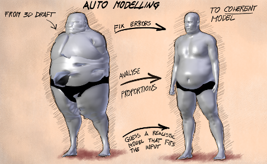

Пользователь быстро модифицирует персонажа, чтобы смутно подсказать, что он имеет в виду, и система работает над этим, исправляя ошибки и создавая персонажа, который лучше всего подходит для ввода пользователя.

С помощью этого метода художник может создать своего базового персонажа практически в два клика.

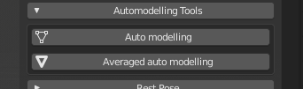

Первая кнопка «автоматическое моделирование» исправляет аномалии, чтобы преобразовать модель в соответствующего реалистичного человека; кнопка «сглаживать» нормализует характер, делая его более «равномерным» и плавным.

Система не использует математические методы, такие как PCA или SVD, но опирается на теорию пропорций, которая более знакома художникам и уже хорошо изучена гениями Ренессанса, такими как Леонардо Да Винчи и Пьеро Делла Франческа.

Алгоритм оптимизирован и не требует больших системных ресурсов. Практически он анализирует данные пропорции, используя некоторые интеллектуальные алгоритмы, а затем создает связный символ, который соответствует этим пропорциям как можно ближе.

«Связный» означает, что система может распознавать, например, если окружность большого бицепса относится к бодибилдеру или человеку с избыточным весом, поэтому она не возвращает персонажа с туловищем бодибилдера и руками человека с избыточным весом.

========
Measures / Меры
========

Можно определить форму персонажа, используя набор мер тела. Эта новая функция доступна только для человеческих персонажей (то есть она не доступна для аниме).

По умолчанию меры не включены, и в столбце отображаются только анатомические данные. Верхний элемент является селектором для категории морфинга.

Категория морфинга - это элемент тела (например, голова) или набор морфингов (например, единицы выражения).

С помощью редактора мер графический интерфейс пользователя разделен на два основных раздела: столбец анатомических параметров и столбец измерений. 

В зависимости от выбранной категории на панели будут отображаться ползунки для увеличения или уменьшения определенной функции. В большинстве случаев параметры очень интуитивно понятны, например, увеличение или уменьшение длины плеча, но в некоторых случаях вам нужно попытаться увидеть, что происходит, например, увеличение или уменьшение долихоцефального значения головы.

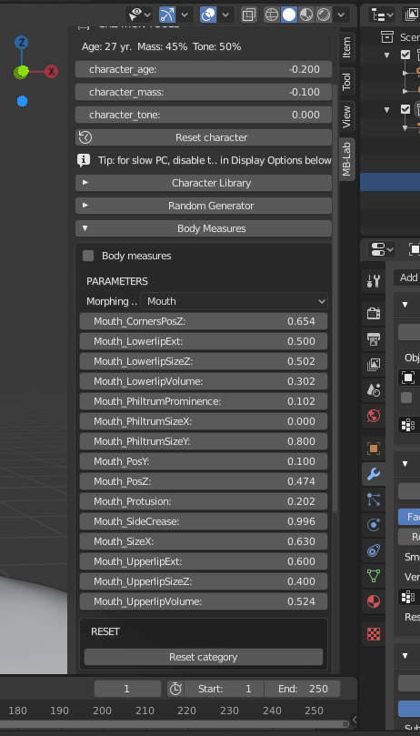

Редактор мер включен, выбрана опция «Измерения».

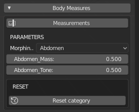

Когда редактор показателей включен, панель «Параметры тела» содержит два основных раздела: столбец анатомических параметров и столбец показателей. Первый столбец посвящен анатомическим деталям. Второй столбец содержит основные антропометрические показатели, используемые в дизайне, антропологии и пошиве одежды.

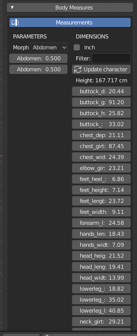

Существует также возможность использовать «дюймы», а не «сантиметры», чтобы преобразовать одну измерительную систему в другую. Это обновления в режиме реального времени.

Существует три способа задания показателей тела: прямой, косвенный и загрузка файла мер.

**Direct method** ** Прямой метод **

Прямой метод заключается в установке значений (в сантиметрах или дюймах) непосредственно в столбце меры. При нажатии на кнопку «Автоизмерение» система проанализирует пропорции и вернет связного человека, который максимально приближает все заданные значения. Сравнивая показатели с базой данных, система может, например, распознать, является ли большая окружность верха частью тела бодибилдера или персонаж с избыточным весом, и создать непротиворечивую модель.

**Indirect method** ** Косвенный метод **

Косвенный метод заключается в изменении значений анатомических параметров, отслеживании изменений в столбце измерения. Это может быть сложно, так как каждый параметр обычно влияет на множество мер одновременно, но это может быть хорошим способом для небольших корректировок или для проверки размеров персонажа.

**Loading a measure file** ** Загрузка файла меры **

Система также может экспортировать и импортировать меры, используя простой формат json. Этот формат удобен для чтения, легко переносим и прост в создании, поэтому его можно легко перенести на внешнее программное обеспечение для связи с MB-Lab.

**Precision** ** Точность **

Благодаря этому алгоритму результирующие показатели могут немного отличаться от ввода пользователя. В частности, если данные меры нереалистичны или очень необычны, результат может представлять заметные различия. Точность метода будет увеличивать выпуск за выпуском пропорционально росту базы данных лаборатории.

Рост персонажа не может быть назначен напрямую, но он автоматически рассчитывается как сумма высоты шеи, туловища, ягодиц, верхней части ноги, нижней части ноги и ступней.

**Reset** **Сброс**
Кнопка «Сбросить категорию» сбрасывает все ползунки выбранной категории, устанавливая их значение на 0,5.

===========
Model Types / Типы моделей
===========

«Тип» определяет в одном кадре все основные черты тела: строение кости, процент жира, массу и мышцы. Каждый тип создается на основе антропометрических данных и художественных наблюдений и очерчивает тело персонажа.

Типы маркируются с использованием простых имен, таких как «идеальная мода», «атлетический», «ленивый», «песочные часы».

Система использует идентификаторы такого рода, потому что они менее трудны для запоминания и более интуитивны, чем научные термины, используемые в антропометрии.

Типы могут быть выбраны через интуитивно понятный графический интерфейс на главной панели, также можно использовать опцию «Смешать» для смешивания различных типов.

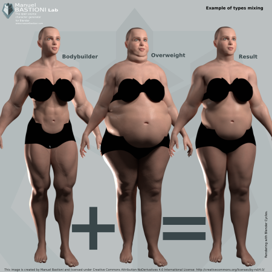

«Специальный тип» отличается от «типа», потому что он может описывать нереалистичные существа (например, комических героев, грубых и других людей с увеличенными пропорциями) или объекты только для данных (например, «старые» и «младшие» специальные типов).

В зависимости от изменяемых функций и способа их изменения, типы могут быть сгруппированы в несколько больших категорий:

* Типы определяются в основном вариациями мышечного и массового процента
* Типы определяются в основном изменением пропорций
* Типы, определенные основными формами

Примеры типов

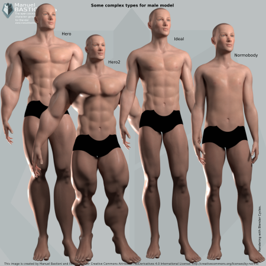

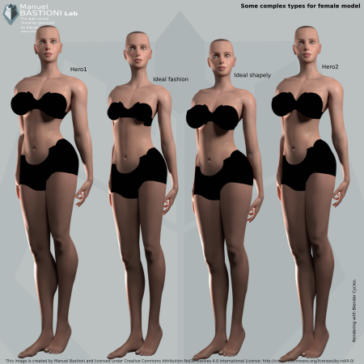

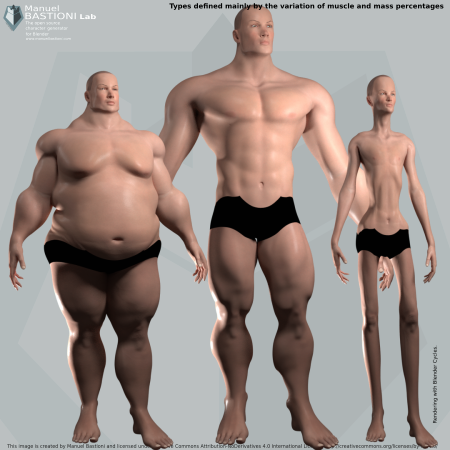

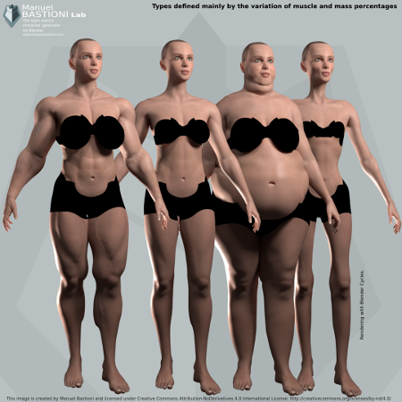

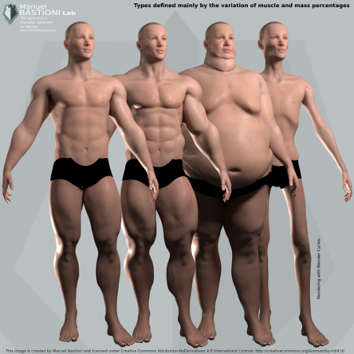

==========
фенотипы
==========

«Фенотип» определяет просто физический облик класса персонажей, он не связан с политикой, культурой, языком или историей. Он используется для описания вариаций человеческих черт в связи с эволюцией в конкретной географической области.

MB-Lab поддерживает большинство распространенных фенотипов человека в части объемного моделирования.

Фенотипы маркируются с использованием географического положения, где каждый фенотип статистически более распространен.

Доступные фенотипы зависят от выбранного базового символа:

* Афрофенотипы

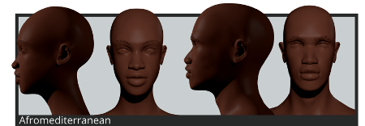

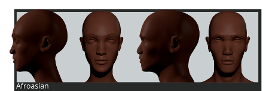

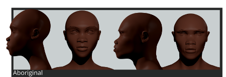

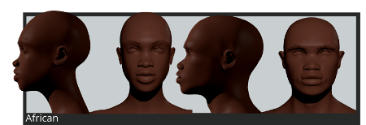

* Азиатские фенотипы

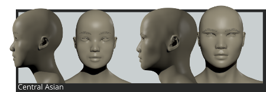

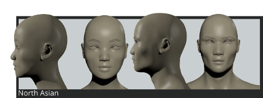

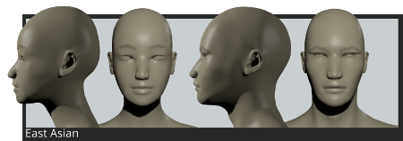

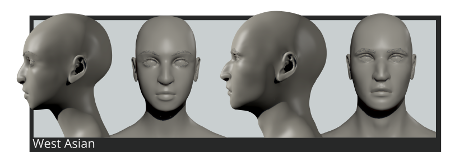

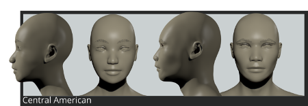

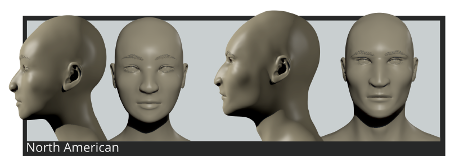

* Кавказские фенотипы

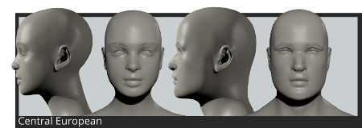

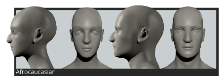

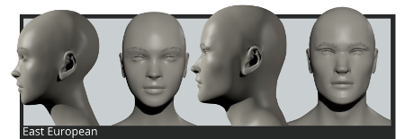

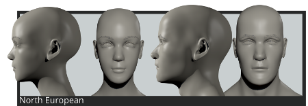

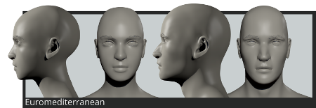

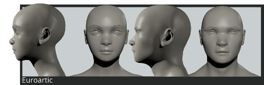

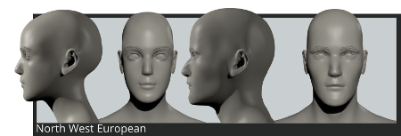

