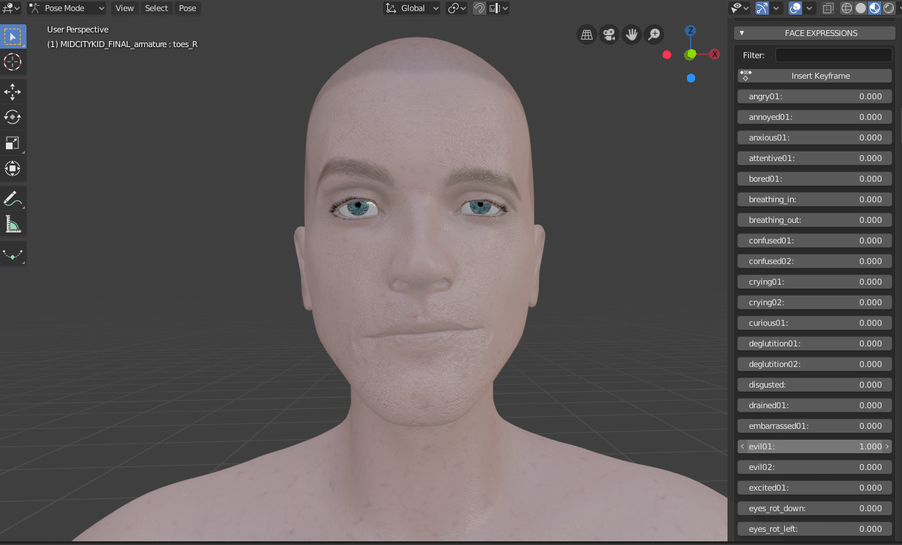
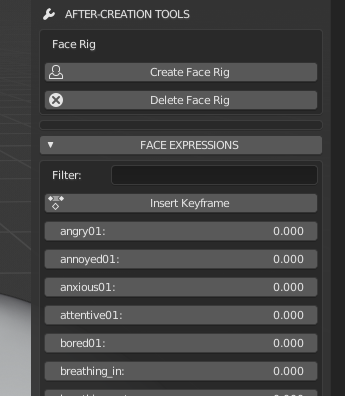

=========== 
Expressions / Выраженность
===========

Когда модель завершена, инструменты после создания включены. Если пользователь не изменяет топологию и формы клавиш персонажа, инструмент «выражения лица» после создания покажет набор интуитивно понятных ползунков.

Этот инструмент очень прост в использовании: просто перемещайте ползунки, чтобы смешать различные выражения.

Вы также можете использовать кнопку «Вставить ключевой кадр», чтобы вставить анимационный ключ в текущий кадр.

В конце списка есть еще одна кнопка «Сбросить выражение», чтобы сбросить все выражения до нулевого значения.

За этим простым использованием существует сложный алгоритм, который переводит линейную комбинацию компонентов высокого уровня (например, 0,3 * улыбка + 0,5 * ухмылка + 0,1 * печальный ecc ..) в линейную комбинацию нескольких базовых элементов низкого уровня (x1 * mouth01 + x2 * mouth02 + x3 * eye01, ecc ..). Этот подход решает в большинстве случаев проблему «гипер-выражений», что очень часто происходит при прямой интерполяции shape-клавиш выражения.
