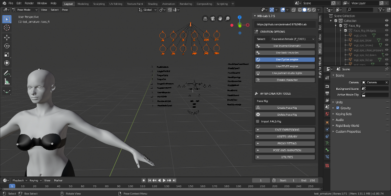
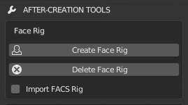
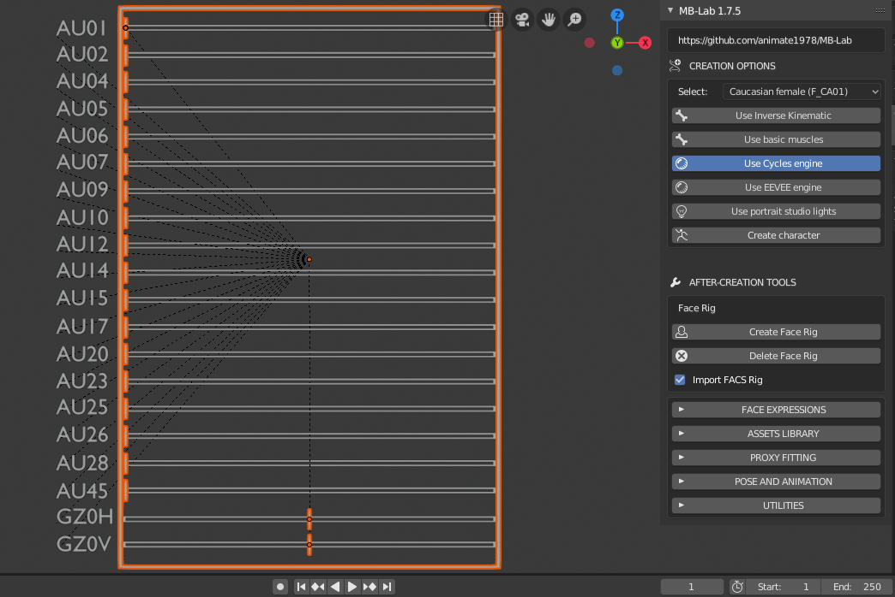

========
Face Rig
========

Face Rig разработан для анимирования выражения лица, используя специальную оснастку.

Этот риг контролирует различные выражения персонажа MB-Lab, используя элементы управления, показанные выше.

Эта функция была запущена в качестве эксперимента в MB-Lab 1.7.1 и обновлена для этого выпуска.

Чтобы добавить оснастку, просто нажмите кнопку «Добавить лицевую оснастку» для вашего финального персонажа.

Чтобы удалить риг, сначала нужно выбрать финализированный персонаж, а затем нажать кнопку «Удалить риг».

Существует известная ошибка, которая появляется, когда вы пытаетесь удалить риг без предварительного выбора персонажа, это уже рассматривается.

Face Rig также имеет возможность импортировать установку FACS, которая является усовершенствованной для автоматической синхронизации губ с использованием этих других дополнений Blender.

https://github.com/amirpavlo/YASP

https://github.com/amirpavlo/BYASP

