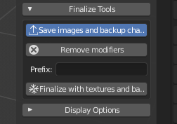

========
Finalize / Финализация
========

Последние шаги в развитии вашего персонажа.

=======================
Pre-Finalized Character / Предварительно завершенный персонаж
=======================

* Имя не должно быть изменено.
* Не может включать в себя ключи формы
* Это не может быть настроено в режиме редактирования или с помощью скульптинга
* Не добавлены или удалены вершины
* Используются непосредственно текстуры из данных лаборатории 
* Это единственный персонаж MB-Lab в сцене

Чтобы снять эти ограничения и включить инструменты «после создания», лабораторная модель должна быть преобразована в обычную модель с использованием процесса финализации.

===============================
Finalization effect and options / Эффект финализации и параметры
===============================

Финализация - это процесс очистки всех пользовательских свойств, выбора позы покоя, добавления набора стандартных ключей формы для выражений и преобразования лабораторного персонажа в обычный персонаж для Blender, не связанный с лабораторным сценарием, который может обрабатываться как и любая другая нормальная модель в Blender.

У финализированного персонажа будет следующее

* Установленная арматура (определяется при запуске)
* Набор стандартных ключей формы для выражений
* Модификатор поверхности подразделения
* Корректирующий гладкий модификатор
* Модификатор смещения
* Поверхностные шейдеры

Панель финализации содержит несколько важных опций.

Раздел финализации включает в себя два варианта.

* Сохранение изображений и резервного копирования. Чтобы экспортировать текстуры в пользовательскую папку и сделать резервную копию символа в виде файла JSON. Новый путь к изображениям будет сохранен в шейдере, и он, как обычно, будет редактироваться в редакторе узлов Blender. Файл резервной копии позволит восстановить символ с помощью кнопки «импортировать символ».
* Удалить модификаторы. Все модификаторы (недра, смещение, корректирующее сглаживание и т. Д.), За исключением модификатора якоря, будут удалены из завершенного символа.

Для финализации персонажа достаточно нажать кнопку «Завершить». Он расположен внизу лабораторной панели.

Внимание! Эта операция необратима!

Процесс завершения !! НЕ обратим, и он преобразует лабораторную модель в обычную модель, поэтому он потеряет все лабораторные функции и не будет редактироваться с помощью лабораторных инструментов.

По этой причине опция «Сохранить изображения и резервные копии» очень важна и включена по умолчанию.

Производственный конвейер и этап доработки:

* Персонаж сохраняется или экспортируется в виде лабораторного файла в папку «Архив персонажей» (см. «Сохранение и экспорт персонажа для получения дополнительной информации»).
* Персонаж конвертируется в обычную модель Blender (завершена).
* Теперь персонаж можно настроить в режиме редактирования и использовать как любой другой обычный персонаж. Он может быть экспортирован в любой формат, поддерживаемый Blender, или добавлен в другую сцену Blender для окончательного производства.
