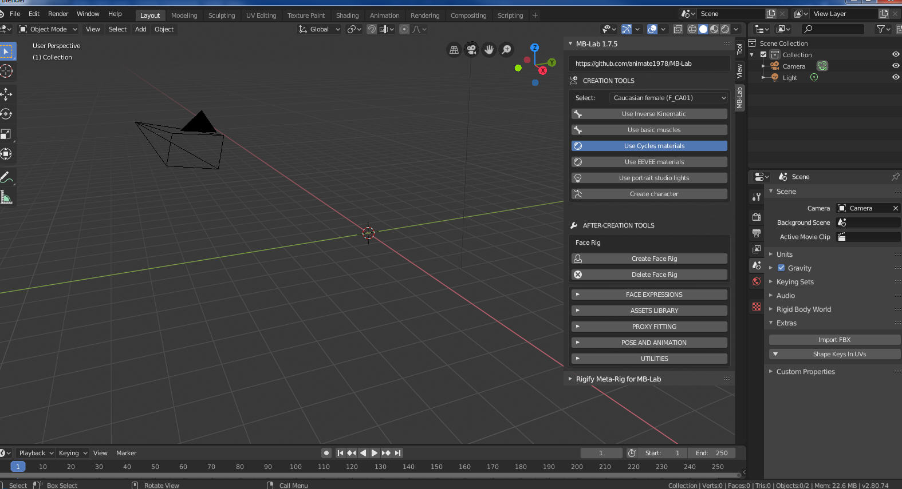
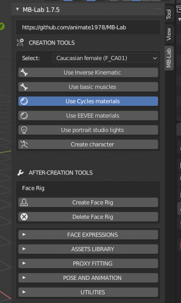
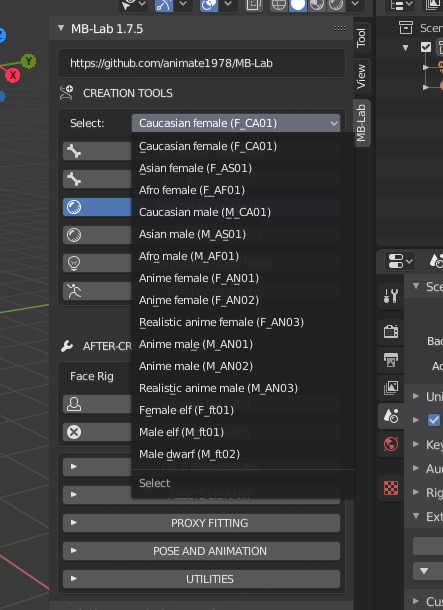
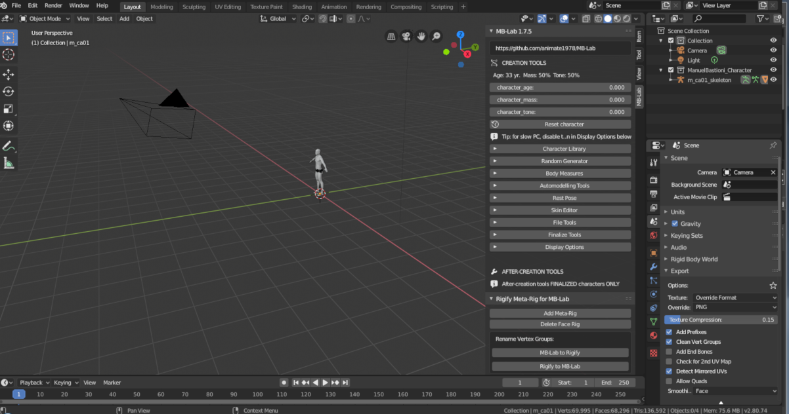
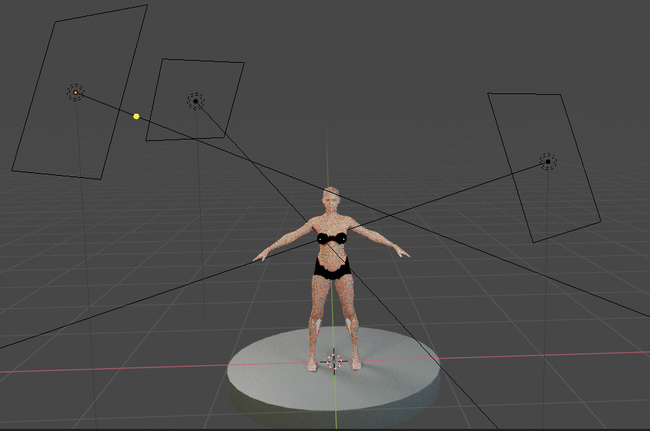

===============
Getting Started / Начало
===============

Пользовательский интерфейс прекрасно интегрирован в Blender и разработан, чтобы сделать процесс моделирования простым и понятным процессом.

В начале раздел создания содержит только несколько элементов:

* Селектор для выбора базовой модели
* Опция, относящаяся к типу скелета (базовая, с обратной кинематикой, с изгибными мышцами)
* Кнопка создания, чтобы инициализировать его
* Некоторые параметры, связанные с рендерингом движка и освещения

MB-Lab включает в себя набор базовых символов, как показано на рисунке:

Нажав кнопку «Создать персонажа», Blender создаст выбранную модель, поместив ее в центр сцены, с координатами 0,0,0.

MB-Lab был переработан для Blender 2.80 и теперь имеет сети затенения для Cycles и EEVEE. Выбор любого варианта также выберет необходимый механизм рендеринга.

Опция «Использовать портретные студийные источники света» предназначена для создания набора источников света для воспроизведения профессиональной студийной установки.

Примечание: шкала составляет один BU (Blender Unit) = один метр.

Система должна импортировать несколько сотен морфов, поэтому для ее завершения требуется некоторое время. В конце процесса персонаж будет готов к модификации.

.. toctree::
   :maxdepth: 2

   base_char
