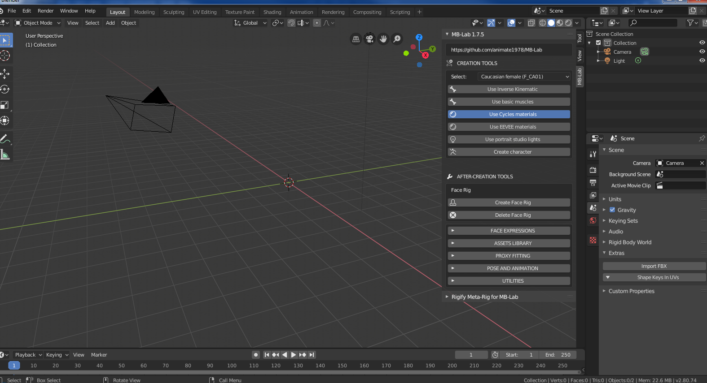
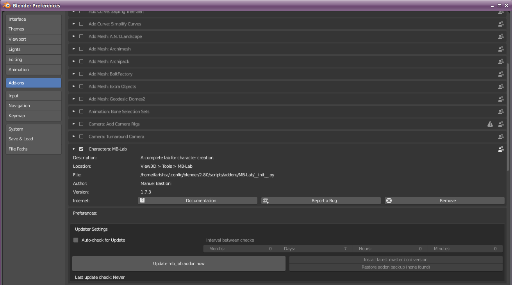

============
Установка
============

==============
Установка MB-Lab
==============

**Внимание!**

Одной из наиболее распространенных проблем является установка MB-Lab, что, как мы все признаем, является проблемой из-за того, что пакеты GitHub выпускают ZIP-файлы. Пожалуйста, прочитайте ВНИМАТЕЛЬНО!

Если вы загрузите клон, где Github переименован в MB-Lab-master, у вас не возникнет проблем.

Релизы пакетов Github будут влиять на то, как вы устанавливаете MB-Lab, ТОЛЬКО при загрузке со страницы релиза!

GitHub упаковывает ZIP-файлы с номерами версий в названии. Папка ВНУТРИ этого ZIP-файла - это то, что нужно изменить, вам нужно перейти в этот каталог и переименовать его с **MB-Lab 1.xx** на **MB-Lab-1-xx** или **MBLAB175** если проще, **просто избавьтесь от точек в имени каталога**, и Blender распознает его и добавит аддон в список.

Это связано с тем, что если вы устанавливаете надстройку с периодами, Blender предполагает, что это расширение какого-либо типа, и запутывается, что приводит к путанице в большинстве проблем установки с MB-Lab.
Если вы загрузите клон, где Github переименует его ** MB-Lab-master **, у вас не возникнет проблем.

* Шаг 1

В Blender 2.80 откройте окно пользовательских настроек, выбрав «Правка» → «Настройки».

* Шаг 2

Нажмите кнопку «Установить» в верхней правой части окна.

* Шаг 3

Используйте окно выбора файла, чтобы найти zip-файл, выберите его и нажмите кнопку «Установить дополнение из файла».

* Шаг 4

Когда установка будет завершена, в списке «Категории» появится новый элемент «MB-Lab». Выберите его и включите лабораторию, используя кнопку проверки. Когда плагин включен, не забудьте нажать кнопку «Сохранить настройки пользователя», чтобы автоматически загружать лабораторию при каждом запуске Blender.

* Шаг 5

Закройте окно настроек пользователя.
Нажмите «N», чтобы в Blender 2.80 появилась боковая панель с интерфейсом MB-Lab.

================
Удаление MB-Lab
================
В Blender откройте окно пользовательских настроек, выбрав «Файл» → «Пользовательские настройки».
На вкладке дополнения найдите  MB-Lab

.. image:: images/remove_01.png

Нажмите на кнопку «Удалить».

ОЧЕНЬ ВАЖНО !! не устанавливайте несколько копий ManuelBastioniLAB или MB-Lab, будут конфликты! Сначала удалите старую версию, затем установите из файла новую версию.

=============================
РУЧНАЯ УСТАНОВКА / УДАЛЕНИЕ
=============================

Вы также можете установить MB-Lab вручную. Вам необходимо разархивировать MB-Lab в следующие каталоги для вашей ОС.

* Windows 7 - C: \ Users \ USERNAME \ AppData \ Roaming \ Blender Foundation \ Blender \ 2.80 \ scripts \ addons
* Windows 10 - C: \ Users \ USERNAME \ AppData \ Roaming \ Blender Foundation \ Blender \ 2.80 \ scripts \ addons
* Linux - /home/USERNAME/.config/blender/2.80/scripts/addons/
* MacOS - ~/Library/Application Support/Blender/2.80/scripts/addons/

Чтобы удалить, просто удалите каталог MB-Lab из вашей файловой системы

=========
Обновление
=========
Начиная с версии **MB-Lab 1.7.3** теперь возможно обновить аддон внутри Blender, не выполняя много дополнительных шагов клонирования репозитория, загрузки аддона и установки каждый раз, когда происходит обновление MB- лаборатория

Для обновления перейдите в «Правка» → «Настройки» → «Дополнения», а затем нажмите стрелку, чтобы развернуть информацию о дополнениях.

Чтобы обновить MB-Lab до последней версии в ветке «master», нажмите «Обновить аддон mb_lab сейчас»

Вы также можете настроить надстройку на автоматическую проверку, установив интервал между проверками. Есть варианты для месяцев, дней, часов и минут. Рекомендуется проверять каждые 2 недели до месяца, основываясь на истории обновлений MB-Lab.

===============
Клонирование из GIT
===============

Вы можете клонировать проект MB-Lab непосредственно в каталог дополнений, например, так работают разработчики.

1) Английская версия:
https://github.com/animate1978/MB-Lab.git
Есть две основные ветви.
    Мастер - это код "релиз"
    Dev - это код разработки
2) Русифицированная версия:
https://github.com/SergeyRom-23/MB-Lab-master-RU
