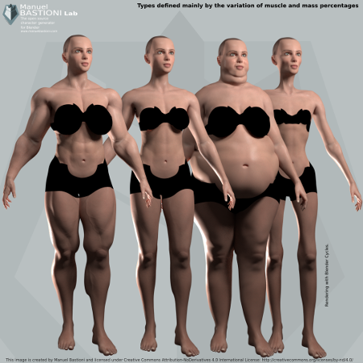

===========
Model Types / Типы моделей
===========

«Тип» определяет в одном целом все основные черты тела: строение кости, процент жира, массу и мышцы. Каждый тип создается на основе антропометрических данных и художественных наблюдений и очерчивает тело персонажа.

Типы маркируются с использованием простых имен, таких как «идеальная мода», «атлетический», «ленивый», «песочные часы».

.. image:: images/modeltypes_01.png

Система использует идентификаторы такого рода, потому что они менее трудны для запоминания и более интуитивны, чем научные термины, используемые в антропометрии.

Типы могут быть выбраны через интуитивно понятный графический интерфейс на главной панели, также можно использовать опцию «Смешать» для смешивания различных типов.

.. image:: images/mixtypes_03.png

.. image:: images/gallery_140_28.png

«Специальный тип» отличается от «типа», потому что он может описывать нереалистичные существа (например, комических героев, грубых и других людей с увеличенными пропорциями) или объекты только для данных (например, «старые» и «младшие» специальные типов).

В зависимости от изменяемых функций и способа их изменения, типы могут быть сгруппированы в несколько больших категорий:

* Типы определяются в основном вариациями мышечного и массового процента
* Типы определяются в основном изменением пропорций
* Типы, определенные основными формами

Примеры типов

.. image:: images/gallery_140_25.png

.. image:: images/gallery_140_26.png

.. image:: images/gallery_140_27.png

.. image:: images/gallery_140_13.png
