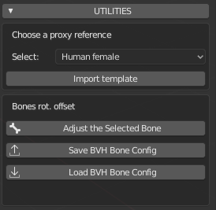

============
New Features / Новые возможности
============

=============
Версия 1.7.6
=============

Эта версия имеет несколько новых функций!

* Тип модели латиноамериканца

Эта версия включает новый тип латиноамериканской модели, а также новый южноамериканский фенотип.

* Тон кожи для каждого типа модели реалистичных людей

Теперь тоны кожи по умолчанию будут загружаться для каждого типа модели.

* MB-Lab Скин 2

Это совершенно новый шейдер скинов, использующий больше процедурных элементов, чем в предыдущих версиях, исключающий множество карт текстур для простых функций рендеринга (Specular, SSS, Roughness и т. Д.)

* Шейдер для ногтей

Это новый шейдер для ногтей на пальцах рук и ног с возможностью смешивать «натуральный» и «окрашенный».

=============
Версия 1.7.5
=============

Предполагается, что эта версия будет «официальной» стабильной версией Blender 2.80 после ее официального выпуска.

* Изменение графического интерфейса

Эта версия показывает эволюцию графического интерфейса, который изменился по сравнению с оригинальной версией 1.6.1.

Везде были добавлены иконки!

.. image:: images/GUI_175.png

* Улучшенная оснастка для лица

Face Rig была обновлена, с новым FACS способным Rig

* Шейдер языка

Теперь вы можете редактировать цвет кожи, не меняя цвет языка.

* Улучшенные шейдеры для глаз и радужной оболочки глаза

Это было очень позднее дополнение к MB-Lab 1.7.5, но выглядит фантастически по сравнению с предыдущими версиями.

* Анимация BVH файлы

Это «сырые» BVH-файлы некоторых основных анимаций, таких как ходьба, бег, прыжки и т. Д.

* BVH настройка костей

Сохраните и загрузите файлы конфигурации для настройки костей после импорта файлов анимации BVH.

=============
Версия 1.7.4
=============

Шейдеры для этой версии были переработаны с нуля, чтобы добиться максимально реалистичного вида.

Шейдер скинов отбросил узел Principled BSDF в пользу новой сети пользовательских узлов.

Процедурные вены были добавлены. Видимость вен контролируется ползунком в редакторе скинов.

Глаза стали полностью процедурными в этой версии, которая обеспечивает больший диапазон цвета для радужной оболочки, чем раньше.

Видимость вен глаз контролируется с помощью ползунка.

Настройка освещения была изменена на трехточечную компоновку с использованием Area light.

=============
Версия 1.7.3
=============

Эта версия дополнена автоматическим обновлением.

.. image:: images/auto_updater_173.png

Это позволит пользователям обновлять новые версии MB-Lab без необходимости переходить на Github или вручную.

Программа обновления может автоматически проверять интервал, заданный пользователем.

Программа обновления также может создавать резервные копии MB-Lab, поэтому, если случайно выпущена ошибочная версия, она может вернуться к рабочей версии.

Единственным недостатком является то, что средство обновления работает с версии 1.7.3 и выше, поэтому возврат к предыдущим версиям невозможен, что также делает его довольно важным обновлением.
