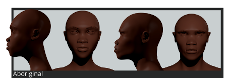
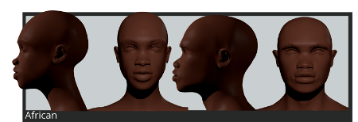
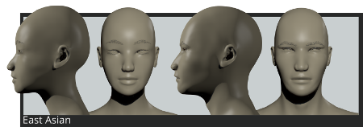
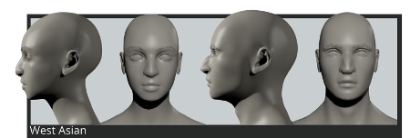
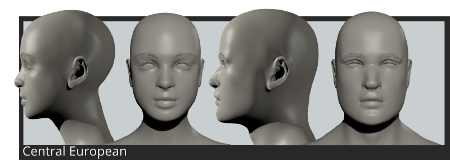
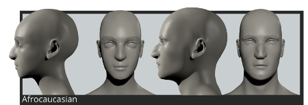

==========
Phenotypes / фенотипы
==========

«Фенотип» определяет просто физический облик класса персонажей, он не связан с политикой, культурой, языком или историей. Он используется для описания вариаций человеческих черт в связи с эволюцией в конкретной географической области.

MB-Lab поддерживает большинство распространенных фенотипов человека в части объемного моделирования.

Фенотипы маркируются с использованием географического положения, где каждый фенотип статистически более распространен.

Доступные фенотипы зависят от выбранного базового символа:

* Афрофенотипы

.. image:: images/phenotypes01.png

.. image:: images/phenotypes02.png

* Азиатские фенотипы

.. image:: images/phenotypes05.png

.. image:: images/phenotypes06.png

.. image:: images/phenotypes08.png

.. image:: images/phenotypes09.png

.. image:: images/phenotypes10.png

* Кавказские фенотипы

.. image:: images/phenotypes13.png

.. image:: images/phenotypes14.png

.. image:: images/phenotypes15.png

.. image:: images/phenotypes16.png

.. image:: images/phenotypes17.png

