====
Pose / Позы
====

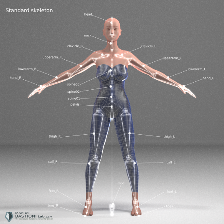

Все персонажи в MB-Lab оснащены одинаковой базовой структурой скелета, для стандарта и обмена позами и анимацией.

Основной скелет разработан так, чтобы быть чистым и соответствовать большинству файлов захвата движения и игровых движков. Корень расположен на полу, а детальная оснастка для пальцев объединена в одной кости.

В **версии 1.6.0** и выше, на основном скелете построены две усовершенствованные конструкции такелажа: система обратной кинематики и система базовой мышцы. Эти две системы могут быть объединены, так что возможно иметь персонажа, который использует их обоих.

Как обычно, графический интерфейс для использования этой технологии очень прост: системы оснастки - это просто варианты выбора перед созданием персонажа.

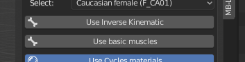

Начиная с **версии 1.5.0** стандартный скелет также включает в себя восемь костей

Структура руки классическая, с общими названиями для пальцев. Рука использует четыре кости на палец, имея метакарп, который очень важен для некоторых положений руки.

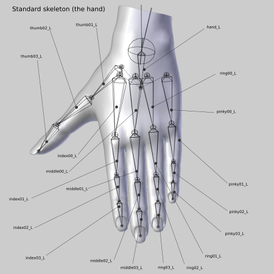

===============
Rigging Systems / Системы оснастки (одежды и т.п.)
===============

MB-Lab предлагает несколько вариантов оснащения.

* Базовый скелет
* Базовая мышца
* И.К. Скелет
* IK скелет и мышцы

Эти параметры можно выбрать при запуске MB-Lab.

В зависимости от выбранных параметров снаряжения будет определяться получившееся снаряжение и, в конечном итоге, как персонаж будет использоваться в зависимости от потребностей пользователя.

==================
Muscle base system / базовая система мыщц
==================

MB-Lab включает моделируемую мышечную арматуру. Эта система пытается подражать поведению человеческих мышц

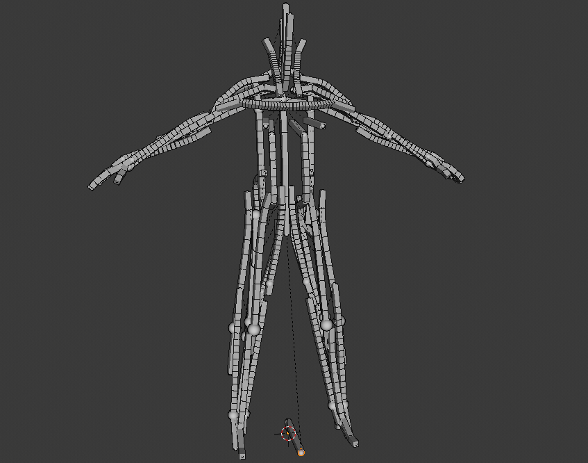

Первоначально был план двух мышечных систем, одна из которых уже включена в MB-Lab, а другая - более продвинутая система, описанная Мануэлем Бастиони как более точная модель. Одно из основных различий между двумя системами состоит в том, что «полная» будет анатомически более точной, но для этого потребуется (вероятно) установить лабораторию на производственном компьютере. Напротив, «базовая» система, уже реализованная в **версии 1.6.0** и выше, которая имитирует только основные мышечные массы, опирается на стандартные инструменты Blender, и после этапа финализации персонаж будет работать над любой последней версией Блендера, с или без установленной лаборатории.

Изображения показывают некоторые особенности мышечной системы и сравнение с базовой системой скелета:

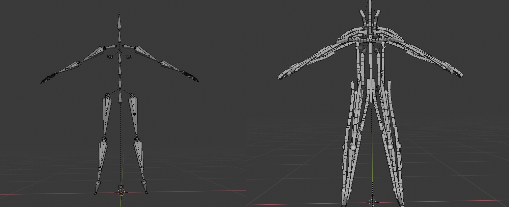

Чтобы достичь этой цели, большое количество времени было потрачено на разработку гибкой арматуры с использованием только базовых встроенных компонентов, предлагаемых Blender, без драйверов, но только с ограничениями. Структура была тщательно протестирована с использованием множества анимационных тестов, в частности, чтобы избежать или минимизировать проблему нежелательных поворотов, которые иногда создаются для экстремальных углов. 

==================
Inverse Kinematics / Инверсионная кинематика. (ik)
==================

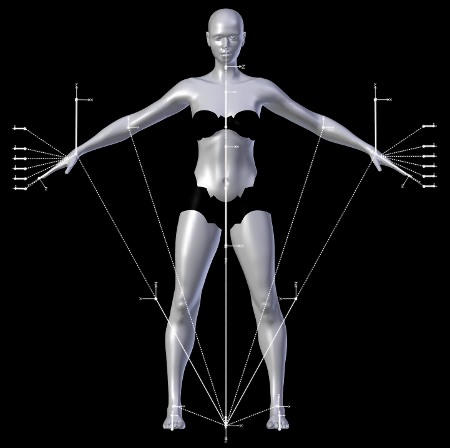

Структура IK предлагает набор дополнительных костей, используемых для простого и интуитивного управления конечностями.

Обратные кинематические контроллеры, включают в себя специальные контроллеры для пальцев (сложное движение-закрытие каждого пальца, полученное в виде комбинации из четырех костей, обрабатывается одним контроллером), контроллеры для пястных костей (один контроллер обрабатывает современные движения всех пястных костей), контроллер для движение пятки-носка, отслеживание цели для головы и многое другое.

==========
Rest Poses / Позы покоя.
==========

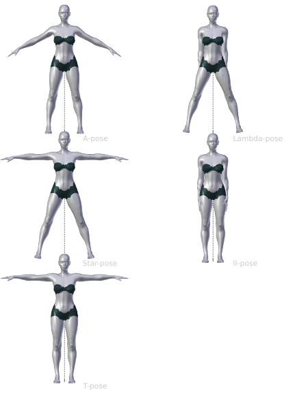

Поза покоя - это то, что вы видите, когда не применяются позы, другими словами, когда все вращения конечностей равны нулю.

Поза покоя является важной особенностью, поскольку она определяет поведение скелета во время анимации и позирования. По этой причине выбор позы покоя является частью фазы «создания» персонажа.

Напротив, позы действий и анимация являются частью фазы «после создания». Подробнее о шагах «создание» и «после создания» можно прочитать в разделе «Процесс моделирования».

* ПРИМЕЧАНИЕ. Селектор положения покоя недоступен для скелетов с обратной кинематикой.

Графический интерфейс очень интуитивно понятен. Вы можете выбрать одну из предустановленных поз покоя из встроенной библиотеки или загрузить / сохранить пользовательскую позу покоя.

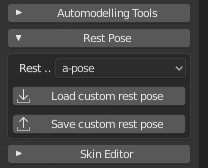

Чтобы загрузить пресет, просто выберите его в раскрывающемся меню:

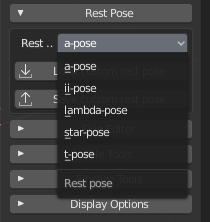

Встроенная библиотека охватывает наиболее распространенные конфигурации, используемые в CG.

Чтобы создать пользовательскую позу покоя, выберите скелет, войдите в Blender в «режиме позы» и продолжите с обычными методами Blender (RKEY для вращения и т. Д.). Затем используйте кнопку «Сохранить пользовательскую позу для отдыха», чтобы сохранить позу как базу данных json. Поскольку все скелеты MB-Lab основаны на одной и той же структуре якоря, позу покоя можно использовать со всеми лабораторными персонажами. Чтобы загрузить пользовательскую позу для отдыха, нажмите кнопку «Загрузить пользовательскую позу для отдыха» и выберите файл позы.

============
Pose library / Библиотека поз.
============

Библиотека поз представляет собой инструмент пост создания, поэтому она доступна только для финализированных персонажей.

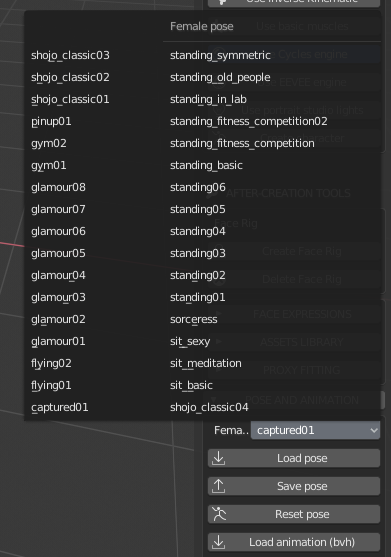

Графический интерфейс для библиотеки поз очень интуитивно понятен: первый элемент - это раскрывающееся меню, в котором отображаются все художественные позы, реализованные в настоящее время, и помеченные интуитивно понятными именами.

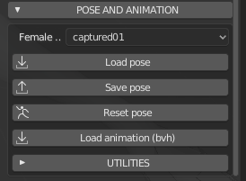

Кнопки «Загрузить позу» и «Сохранить позу» используются для загрузки и сохранения поз с помощью простого файла JSON.

==========
Animations / Анимации.
==========

MB-Lab может загружать необработанную анимацию из файлов bvh. Это продвинутая экспертная система, которая анализирует «анатомию» bvh, автоматически распознает различные элементы (пальцы, голова, позвоночник, ступни и т. Д.). Во время испытаний он успешно распознал наиболее распространенные каркасные структуры, используемые в описаниях mocap.

Анимационная система лучше всего работает с базовой арматурой, было замечено, что использование арматуры Muscles вызовет деформацию сетки тела, на данный момент не совсем понятно, почему. Также невозможно использовать файлы анимации bvh с установкой IK.

=========
Utilities / Утилиты
=========

В некоторых случаях, когда поза покоя bvh не полностью совпадает с покой покоя лабораторного персонажа, необходимо скорректировать углы некоторых частей (обычно ключицы и плечи). Это можно легко сделать, выбрав нужную кость и используя инструмент смещения в разделе «Утилиты».

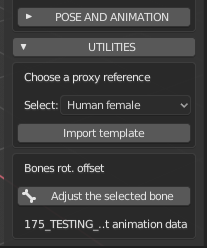

Система не предназначена для коррекции bvh, а просто для загрузки и перенастройки анимации как есть, поэтому такие вещи, как неправильные углы, тремор, частота кадров, должны корректироваться с помощью внешних специальных инструментов.

Сохраните и загрузите файлы конфигурации для настройки костей после импорта файлов анимации BVH.

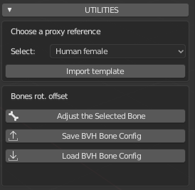

С помощью этой функции вы сможете настроить вращение костей XYZ, сохранить его в файле для конкретной анимации BVH (или более в зависимости от настроек), а затем просто загрузить этот файл всякий раз, когда вы захотите повторно использовать эту анимацию BVH и измененные кости.
