============
Proxy System / Прокси-система
============

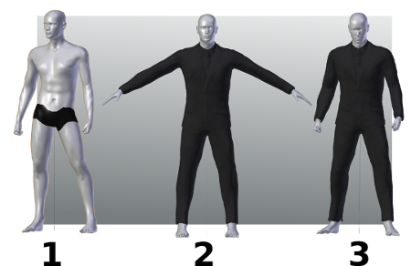

«Прокси» - это сетка, способная соответствовать персонажу, чтобы адаптироваться к его преобразованиям.

Классическим случаем прокси являются одежда и волосы.

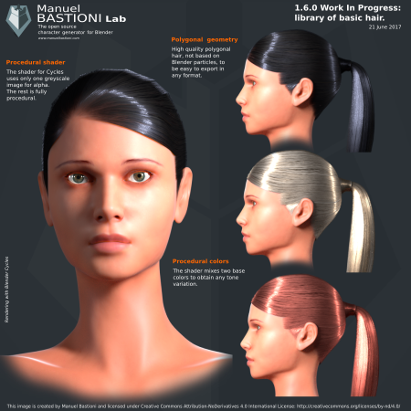

В MB-Lab использование прокси очень просто. Практически он состоит из двух этапов:

* Подготовьте прокси с учетом базового шаблона и сохраните его.
* Загрузите прокси и используйте его на любом производном персонаже.

Персонаж, полученный из базового шаблона, - это персонаж, созданный для изменения лабораторных параметров базовой модели. Например, если вы создали десять символов, инициированных с кавказской женской основой, все они будут получены из кавказской женской базы.

Продолжая этот пример, прокси, предназначенный для кавказской женской базы, будет соответствовать десяти символам одним щелчком мыши.

Еще одной важной особенностью является то, что алгоритм подгонки, используемый в лаборатории, автоматически учитывает повороты и жесткие детали. Это имеет основополагающее значение в случае прокси-серверов, которые сочетают динамическое гибкое и жесткое крепление, например ботинки на высоких каблуках.

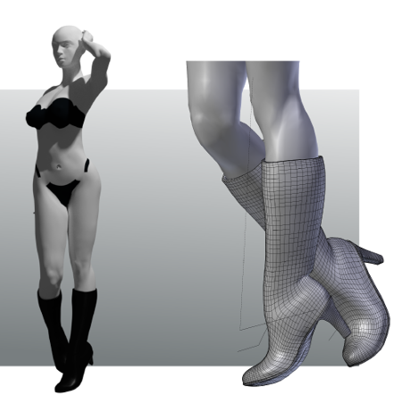

===========
Proxy Usage / Использование прокси
===========

Использование прокси состоит из двух шагов:

* Подготовьте прокси с учетом базового шаблона и сохраните его.
* Загрузите прокси и используйте его на любом производном персонаже.

------
шаг 1
------

**Подготовка прокси с учетом базового шаблона**

1. Откройте «Утилиты» в разделе после создания лаборатории.

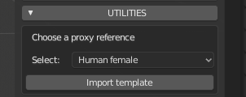

2. Выберите базовый шаблон и загрузите его кнопкой «Импортировать шаблон». В этом примере был загружен кавказский женский шаблон.

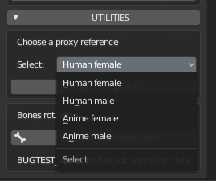

3. Импортируйте сетку для одежды (или смоделируйте новую с нуля). Для этого урока был импортирован стандартный объект Wavefront, но вы можете использовать любой формат и любую технику импорта, поддерживаемую Blender. Алгоритм обрабатывает топологии как треугольников, так и квадратов.

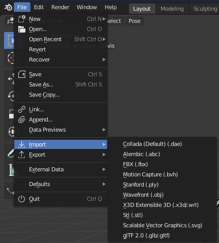

4. Подгоните прокси к персонажу вручную, используя обычные техники Blender (масштабирование, поворот, редактирование вершин и т. Д.). Одним из лучших инструментов для этого является использование кисти Blender Proportional Edit.

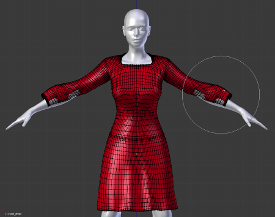

* Используйте инструмент пропорционального редактирования, чтобы одежда была пропорциональна.

ПРИМЕЧАНИЕ. Если вы предпочитаете альтернативный способ, вы можете экспортировать базовый шаблон и установить на него прокси-сервер с помощью внешнего программного обеспечения. В этом случае вы можете пропустить шаги (3) и (4).

5. Сохраните модель прокси. Вы можете сделать это двумя способами:

A) Если вы хотите загрузить прокси-сервер непосредственно из библиотеки ресурсов, сохраните настроенную одежду как файл .blend в папке библиотеки (папку, которую вы выберете в графическом интерфейсе ресурсов, см. «Шаг 2» ниже), используя имя файла идентично имени прокси-объекта. Например, если прокси-объект называется «fabric01», файл должен называться «fabric01.blend».

Б) Если вы хотите загрузить прокси-сервер с помощью универсальных функций Blender, таких как «добавление» или «импорт», сохраните его как смешанный файл или экспортируйте в другой формат 3D, как вам удобнее.

6. Прокси готов. С помощью инструментов лабораторного прокси он автоматически подойдет всем персонажам, созданным на основе выбранного базового шаблона (в данном примере - кавказская женщина).

------
шаг 2
------

**Загрузите прокси и используйте его для любого производного персонажа**

Сценарий: у вас есть завершенный персонаж, созданный в лаборатории, созданный на основе кавказской женщины, и вы хотите разместить на нем прокси. Вы не изменили топологию персонажа.

Первым делом нужно загрузить прокси на сцену.

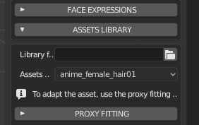

Если вы сохранили его, используя метод (A), описанный выше, откройте панель «Ресурсы библиотеки» и выберите папку библиотеки: ресурс появится в раскрывающемся меню, готовый для загрузки одним щелчком мыши.

ПРИМЕЧАНИЕ. Если при выборе ресурсов ничего не происходит, возможно, имя (мэша?) не соответствует имени объекта.

Если вы сохранили его, используя метод (B), вы должны использовать встроенные функции блендера в меню «Файл»: импортировать или добавлять, в зависимости от формата файла, который вы использовали для хранения прокси.

Для этого примера в качестве эталона был загружен очень мускулистый персонаж, полученный из кавказской базы. Поскольку форма поверхности очень разная, она предлагает пример для всех типичных проблем, которые могут возникнуть во время прокси-фитинга.

Чтобы сделать эталон еще более экстремальным, использовался прокси с юбкой, это самый сложный случай, поскольку между телом и прокси нет прямой связи. Брюки будут проще, поскольку алгоритм может легко распознать, какая часть прокси должна быть связана с правым бедром, а какая часть должна быть связана с левым.

При выборе прокси-объекта и персонажа в разделе «Подгонка прокси» будут показаны инструменты подгонки: параметры «Смещение» и «Влияние», опция «Добавить маску вертигруппы» и кнопки «Подгонка прокси» и «Удалить подгонку». ,

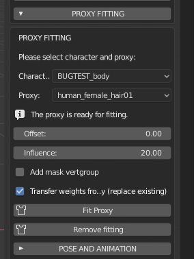

Все прокси инструменты описаны в этом уроке, в любом случае они очень интуитивно понятны, а основной процесс подгонки в большинстве случаев очень прост:

* Импорт или добавление прокси.
* Выберите персонажа и прокси.
* Нажмите кнопку «Fit proxy». Выполнено!

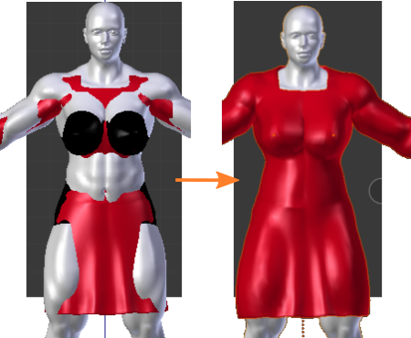

Только в случае деформации или пересечения кожи вам нужно будет поиграть с опциями и параметрами, как описано в следующей части урока.

=====================================================
Dealing with skin intersection and proxy deformations / Работа с пересечением кожи и прокси-деформации
=====================================================

Как уже говорилось, эталонный прокси-сервер, используемый в этом руководстве, покажет вам все возможные проблемы, которые могут возникнуть в процессе. Фактически, после первой примерки, это показывает проблему искажения в центре юбки.

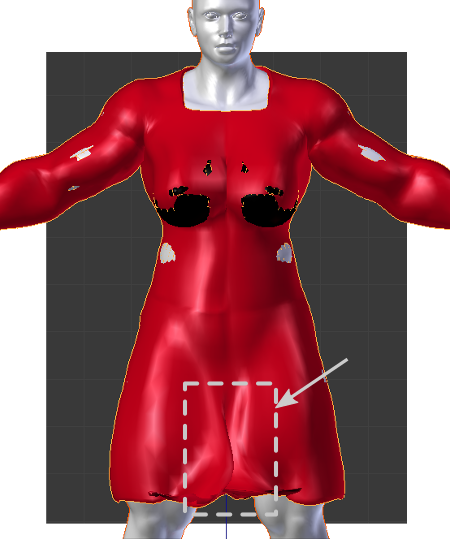

Это можно решить с помощью параметра «Влияние», который управляет «магнитным притяжением» кожи. В этом примере значение было изменено с 500 по умолчанию на более низкое значение 20, и деформация исчезла. Этот параметр работает в лучшем случае, когда персонаж находится в позе покоя (весь прокси-инструмент оптимизирован для размещения одежды в позах покоя, но обычно он работает достаточно хорошо и для других поз).

Теперь, когда деформация исправлена, тест показывает еще одну «классическую» проблему: пересечение поверхности, которое создало «дыры» в прокси.

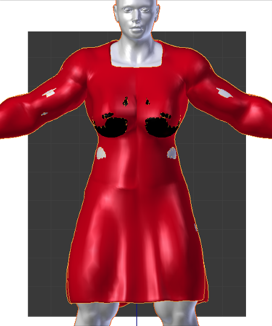

Прокси-система имеет два инструмента для решения проблем пересечения скина: параметр смещения и маска вершин.

Смещение - это интуитивно понятный параметр, который увеличивает расстояние между поверхностью скина и поверхностью прокси. В этом примере было использовано смещение 3,72 вместо значения по умолчанию 0,00. При повторном нажатии кнопки соответствия с этим значением мы замечаем, что большинство пересечений исчезло, но в этом жестком тестовом случае все еще остается видимое пересечение вокруг груди.

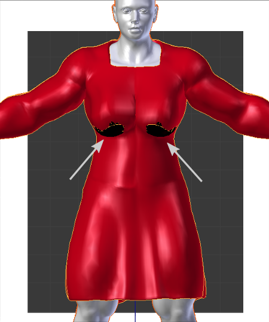

Маска вершин - очень мощный инструмент, который решает практически все проблемы пересечения, которые не могут быть исправлены смещением. Он создает новую группу вершин "mbastlab_mask", которая содержит все вершины тела, которые находятся слишком близко к прокси. Затем он добавляет новый модификатор маски (стандартный модификатор Blender) в стек символов, который скрывает все вершины в этой группе.

Повторное нажатие «Fit proxy», после включения опции «add mask vertgroup», полностью исправит отверстия.

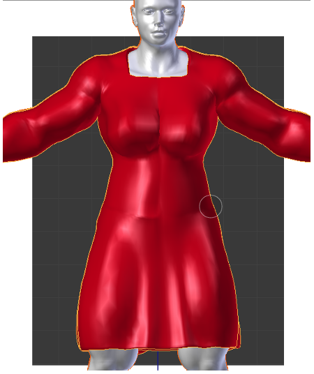

Если вы снимите одежду, вы заметите, что часть тела ближе к прокси скрыта.

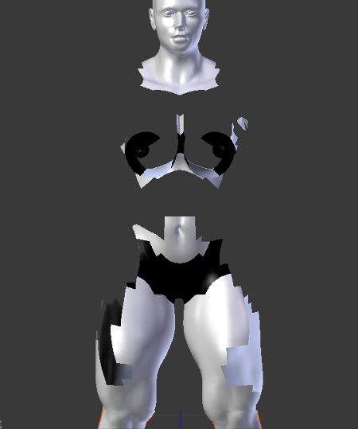

Это просто неразрушающий модификатор: вы всегда можете включить / отключить его или даже вручную отредактировать вершины в группе "mbastlab_mask", чтобы улучшить маску.

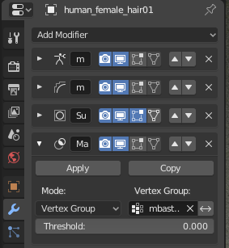

=======================
Edit/remove the fitting / Редактировать / удалить примерку
=======================

После процесса подбора, если вы попытаетесь войти в режим редактирования и вручную переместить вершины прокси, вы заметите, что они «заблокированы». Это происходит потому, что вы пытаетесь отредактировать ключ базовой формы.

Когда прокси подключается к телу, лаборатория автоматически создает два шейп-ключа:

* «Основа» для хранения оригинальной формы прокси.
* «Mbastlab_proxyfit» для хранения текущей подобранной формы прокси.

Как обычно, шейп-ключи перечислены на панели свойств Blender, вкладка data:

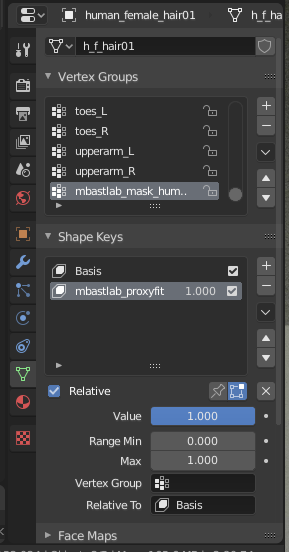

Таким образом, если вы хотите вручную отрегулировать подгонку, вы должны выбрать форму-ключ proxyfit и затем перейти в обычный режим редактирования.

Если вы хотите отредактировать базовый ключ, вы должны сначала удалить все ключи, нажав лабораторную кнопку «Удалить фитинг». В качестве альтернативы вы можете удалить ключи вручную непосредственно с панели Blender, но вы должны помнить, что должны удалять их в следующем порядке: сначала проксифит, а затем основание.

===================
Creating New Assets / Создание новых активов
===================

Создать новый актив на самом деле довольно просто, но для его использования в MB-Lab необходимы определенные требования.

* Масштабируется до базовой модели MB-Lab

Активы нужно масштабировать до размера с помощью сетки MB-Lab. Используйте некоторые ресурсы, найденные в проекте MB-Lab, для справки.

* Назван так же в Outliner, как и имя файла

Это необходимо для того, чтобы аддон распознал файл. (например: anime_hair и anime_hair.blend)
