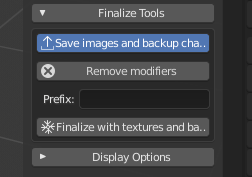

===============
Save and Export / Сохранение и экспорт
===============

Существует много способов сохранить или экспортировать персонажа, созданного в MB-Lab.

============
Finalization / Финализация
============

Первый метод заключается в финализации символа, а затем в сохранении файла смешивания в виде обычной сцены.

В этом случае персонаж будет преобразован в обычную модель наложения, настроен и готов к дальнейшим изменениям с помощью обычных инструментов Blender или экспортирован в другое приложение.

Недостатком использования этого способа является то, что модель утратит специфические особенности MB-Lab. После того, как персонаж завершен, отмены нет.

Преимущество состоит в том, что он не зависит от скрипта, поэтому его можно открыть даже в системе без аддона MB-Lab.

=================
Save Blender File / Сохранить файл Blender
=================

В качестве альтернативы можно сохранить файл смешивания напрямую, без финализации символа. В этом случае, когда лаборатория обнаруживает существующий (не завершенный) персонаж в сцене, она автоматически пытается выполнить повторную инициализацию. Если процесс окажется удачным, лаборатория покажет обычный графический интерфейс.

Этот метод сохранит возможности лаборатории, но вы должны иметь в виду, что в некоторых случаях повторная инициализация может завершиться неудачно (например, если пользователь добавляет шейп-ключи, удаляет вершины, использует другую версию лаборатории и т. Д.)

==============
Export as JSON / Экспортировать в JSON
==============

Экспорт персонажа в JSON - налучший способ сохранить все возможности лаборатории. Также это позволяет модернизировать, конвертировать и восстанавливать персонажа.

Все параметры будут сохранены в очень маленькой базе данных, написанной с использованием стандартного синтаксиса json.

