Редактор скинов
=========== 

MB-Lab предоставляет специальный редактор шейдеров, который можно использовать с Cycles или EEVEE.

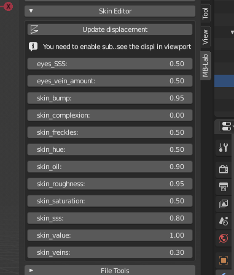

Под Skin Editor находятся наборы сложных поверхностных шейдеров.

Эти шейдеры были разработаны для имитации разнообразных оттенков кожи и работы в любых условиях освещения. В настоящее время существует два набора шейдеров, один «фотореалистичный» набор и «шейдерный» набор шейдеров. Каждый набор шейдеров присваивается конкретным базовым моделям.

* Продвинутый шейдер кожи человека
* Продвинутый шейдер Toon Skin
* Продвинутый набор шейдеров глазного яблока и радужной оболочки глаза
* Шейдеры для зубов, языка и ногтей

Шейдеры используют комбинацию карт текстур и процедурной генерации текстур, карты текстур используются там, где процедурные сгенерированные текстуры не могут работать, в то время как процедурные элементы предоставляют детали, которые карты не могут воспроизвести.

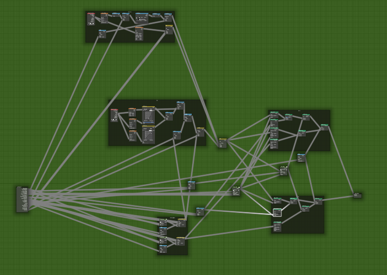

Следующий редактор параметров будет меняться в зависимости от выбранной вами базовой модели. Редактор параметров состоит из интуитивно понятного набора ползунков, позволяющих легко изменять значения цвета кожи, выпуклости кожи, масла кожи, насыщенности кожи, подповерхностного рассеяния кожи и многое другое.

===========================
Realistic Shader Parameters / Реалистичные параметры шейдера
===========================

Реалистичный набор шейдеров кожи является частью реалистичных базовых моделей.

---------------
Skin Complexion / Цвет кожи
---------------
Меняет цвет лица кожи.

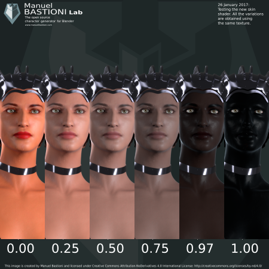

--------
Skin Oil / Масло для кожи
--------
Обеспечивает тонкое воздействие масла на кожу.

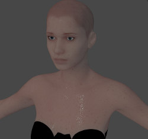
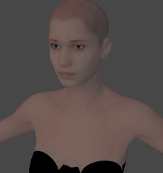

---------
Skin Bump / Кожа Bump
---------
Этот параметр контролирует количество выпуклости кожи. Он не влияет на истинное смещение подразделяемой сетки, а только на визуальный эффект выпуклости, рассчитанный во время рендеринга.

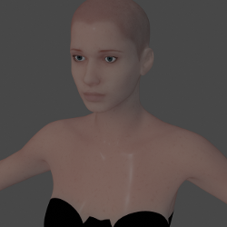
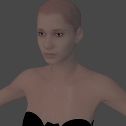

-------------
Skin Freckles / Кожа Веснушки
-------------
Этот параметр контролирует, сколько процедурных веснушек добавляется, на покрытие влияет текстурная маска.

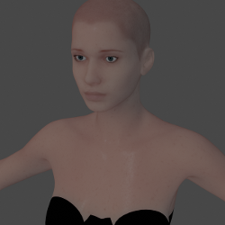
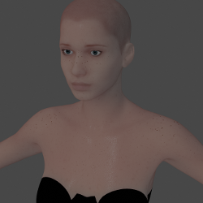

----------
Skin Veins / Кожные вены
----------
Контролирует, сколько процедурных вен добавляется к коже.

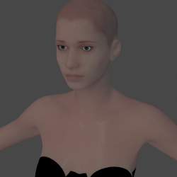
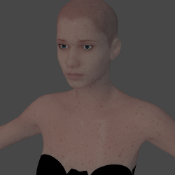

--------------------------
Bump/displacement controls / Контроль удара / смещения
--------------------------
Кнопка «Обновить смещение» использует алгоритм для создания карты смещения на основе комбинации возраста, массы и тона.

Вы должны использовать эту кнопку, чтобы обновлять удар / смещение каждый раз, когда вы меняете мета-параметры. Обратите внимание, что для просмотра этих изменений необходимо включить «Включить предварительный просмотр смещения» в параметрах отображения MB-Lab.

При каждом нажатии кнопки «Обновить смещение» система пересчитывает карту смещения, используя значения метапараметров. Эта карта может быть сохранена с помощью кнопки «Сохранить изображение смещения», чтобы ее можно было использовать во внешних движках или в финализированных символах.

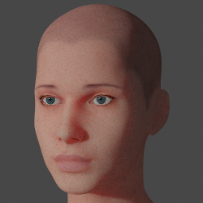
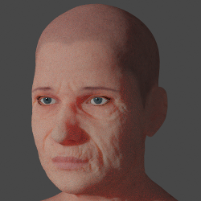

======================
Cell Shader Parameters / Параметры шейдера ячейки
======================
У шейдеров Cell есть несколько различных слайдеров для этого набора.

Имейте в виду, что рендеринг EEVEE и Cycles будет немного отличаться из-за того, как работает шейдер. Также обратите внимание, что этот шейдер очень быстрый, и вы сможете увидеть изменения практически в реальном времени с помощью EEVEE, а также Cycles.

-------------
Skin Oil Size / Размер масла кожи
-------------
Контролирует «масляный» размер ячейки шейдера, этот эффект может выделить контур символов.

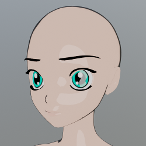
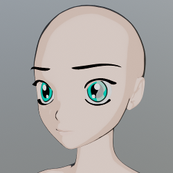

---------------
Skin Oil Value / Значение масла для кожи
---------------
Контролирует яркость "масла", это используется в сочетании с размером масла кожи.

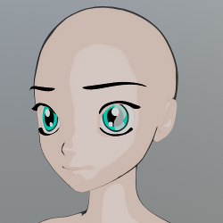
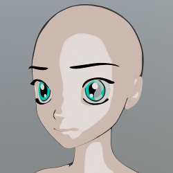

-----------------
Skin Outline Size / Размер контура кожи
-----------------
Контролирует толщину контура символов.

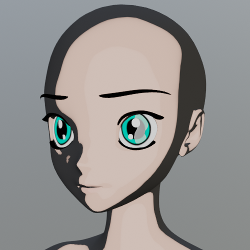
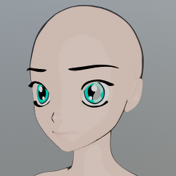

------------------
Skin Outline Value / Значение контура кожи
------------------
Контролирует, насколько темным будет контур.

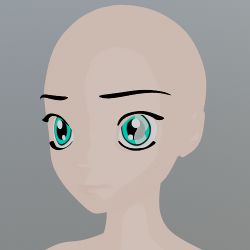
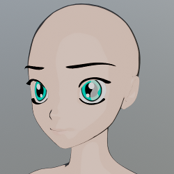

-------------------
Skin Secondary Size / Размер кожи
-------------------
Добавит еще один оттенок к шейдеру ячейки, показывая еще больший контур. ** Этот эффект виден только в циклах в настоящее время **

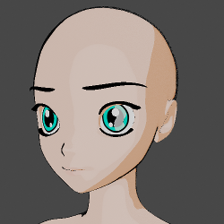
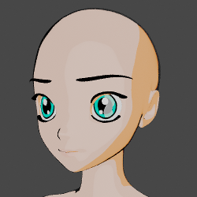

--------------------
Skin Secondary Value / Кожа Вторичное Значение
--------------------
Изменяет значение цвета затенения вторичной ячейки. ** Обратите внимание, что это присутствует только в циклах **

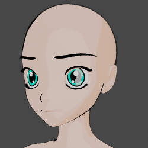
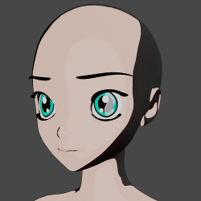

--------
Eyes Hue / Глаза оттенок
--------
Меняет цветовой оттенок радужки в ячейке шейдера.

---------------
Eyes Reflection / Отражение глаз
---------------
Контролирует, сколько поддельного отражения отображается на глазах.

---------------
Eyes Saturation / Насыщенность глаз
---------------
Контролирует насыщенность радужной оболочки, может использоваться в сочетании с Eye Hue для точной настройки цвета.

----------
Eyes Value / Значение глаз
----------
Контролирует значение или легкость радужной оболочки. Как и с насыщением можно использовать для тонкой настройки цвета радужной оболочки.

===================
Eye и Iris Shader / Глаза и радужная оболочка
===================

С версией 1.7.5 поставляется новый набор шейдеров для глаз. Они были переработаны с нуля.

Шейдер радужной оболочки имеет как процедурную сеть, в которой вы можете изменять различные настройки, чтобы получить желаемый эффект, так и версию карты текстуры с элементами управления в MB-Lab, которые также могут изменять цвет. Существует возможность смешать два вместе, чтобы получить интересные эффекты.

Шейдер глазное яблоко (Eyeball) использует новый набор текстурных карт.

В настоящее время в MB-Lab нет возможности изменить цвет ирисовой диафрагмы в редакторе обложек MB-Lab, эта функция рассматривается, но на данный момент есть 2 способа изменить цвет.

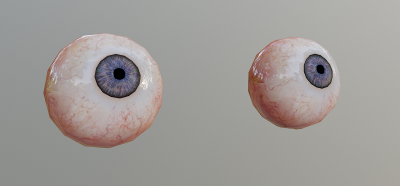

Способ 1. Измените цвет в редакторе узлов.

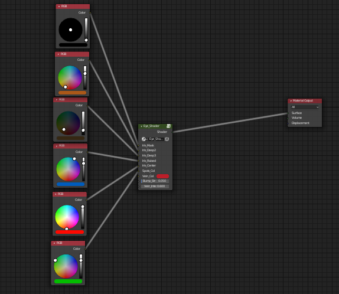

Способ 2. Изменить цвет на панели свойств.

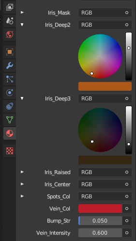

Оба способа требуют небольшого количества щелчков мышью, но шейдер был разработан в надежде на то, чтобы,  упростить изменение цвета радужной оболочки с помощью текущего кода.

------------
Eye Iris Mix / Микс радужной оболочки глаз
------------
Просто смешивает между процедурными или текстурными картами сетей.

--------
Eyes Hue / Глаза оттенок
--------
Меняет цветовой оттенок радужки в сети текстурной карты.

---------------
Eyes Saturation / Насыщенность глаз
---------------
Контролирует насыщенность радужной оболочки, может использоваться в сочетании с Eye Hue для точной настройки цвета.

----------
Eyes Value / Значение глаз
----------
Контролирует значение или легкость радужной оболочки. Как и с насыщением можно использовать для тонкой настройки цвета радужной оболочки.

============
Texture Maps / Карты текстур
============

Для MB-Lab существует несколько текстурных карт, которые обеспечивают определенные эффекты для шейдеров, такие как микромасштабная шероховатость, зеркальность и рассеивание на поверхности.

Как и в случае с шейдерами, существует два набора карт: один для реалистичных персонажей, а другой для аниме-персонажей. В наборе «Реалист» есть множество различных шейдерных эффектов, в то время как в «Аниме» на данный момент есть одна карта альбедо.

Также есть возможность менять эти карты, есть несколько способов сделать это. Одним из вариантов является использование MB-Lab для импорта или экспорта текстурных карт.

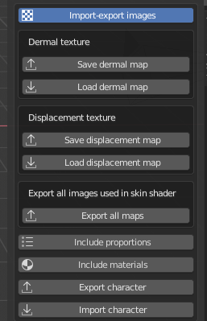

В настоящее время есть только варианты экспорта карты Альбедо и Карты смещения (примечание: для моделей Anime карта смещения отсутствует, поэтому нет возможности экспортировать ее) или Экспорт всех карт одновременно, включая SSS , зеркальные, шероховатости и прочее.

Существует также возможность прямого изменения этих карт через редактор узлов для редактируемого шейдера. Это, например, один из способов разработки новых карт путем замены поставляемой карты текстуры на WIP.

=======================
Post Finalization Notes / Примечания после завершения
=======================

После того, как вы доработаете персонаж MB-Lab, вам больше не понадобится поставлять шейдеры поверхности, если ваши производственные потребности отличаются от назначенных шейдеров, то вполне возможно добавить ваши собственные шейдеры.

Каждая базовая модель имеет шейдеры, назначенные для полигонов, эти шейдеры могут быть легко заменены на ваши собственные, просто заменяя текущие поставленные.

Это также относится к картам текстур, которые поставляются с MB-Lab, и их можно редактировать с помощью предпочитаемого вами редактора изображений (например, Photoshop или GIMP) в соответствии с вашими потребностями.

============
Future Notes / Заметки на будующее
============

Поверхностные шейдеры всегда проходят оценку и тестирование, чтобы попытаться достичь наилучшего визуального представления человеческого тела.

Если у вас есть предложения по поводу поверхностных шейдеров, пожалуйста, не стесняйтесь обращаться к разработчикам.
